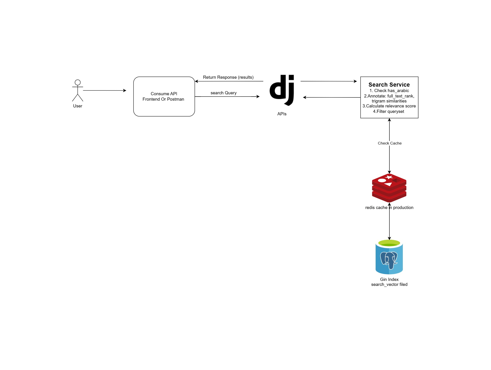

# Product Search API

A powerful and efficient product search API built with Django and PostgreSQL. This API provides advanced search capabilities for products, including handling partial keywords, misspellings, and mixed-language queries (English/Arabic).

## Task Overview

This API is designed to handle large-scale product searches with the following key features:
- Full-text search with PostgreSQL's advanced search capabilities
- Multi-language support (English/Arabic)
- Fuzzy matching for handling misspellings
- Partial keyword matching
- Advanced filtering and sorting
- Performance optimization with caching
- Comprehensive nutrition facts tracking

## Tech Stack

- **Backend Framework**: Django, Django REST Framework (DRF)
- **Database**: PostgreSQL 12+
- **Additional Libraries**:
  - django-filter: For advanced filtering
  - django-cors-headers: For CORS support
  - psycopg2-binary: PostgreSQL adapter
  - django-cacheops: For query caching

## High Level Architecture



## Features

### Search Accuracy and Relevance 
- Full-text search across product names and descriptions
- Fuzzy matching for handling misspellings using PostgreSQL trigram similarity
- Support for partial keywords
- Mixed language support (English/Arabic)
- Smart ranking of search results based on relevance

### Performance and Query Optimization 
- PostgreSQL full-text search indexing with GIN index
- Query result caching for categories and brands (1-hour cache)
- Efficient database queries with select_related
- Pagination support
- Optimized response times

### Code Quality and Structure 
- Clean, maintainable Django code
- Follows Django best practices
- Modular architecture with separate service layer
- Comprehensive test coverage
- Well-documented code

### API Documentation

### Categories

- `GET /api/categories/` - List all categories (cached for 1 hour)
- `GET /api/categories/{id}/` - Retrieve a specific category

### Brands

- `GET /api/brands/` - List all brands (cached for 1 hour)
- `GET /api/brands/{id}/` - Retrieve a specific brand

### Products

- `GET /api/products/` - List all products
  - Query Parameters:
    - `category`: Filter by category ID
    - `brand`: Filter by brand ID
    - `ordering`: Sort by field (name, price, created_at)
- `GET /api/products/{id}/` - Retrieve a specific product
- `GET /api/products/search/` - Advanced product search
  - Query Parameters:
    - `q`: Search query (supports full-text search)
    - `category`: Filter by category ID
    - `brand`: Filter by brand ID
    - `min_price`: Filter by minimum price
    - `max_price`: Filter by maximum price

## Data Models

### Category
- `name` (string): Category name
- `description` (text, optional): Category description

### Brand
- `name` (string): Brand name
- `description` (text, optional): Brand description
- `country_of_origin` (string, optional): Country of origin

### Product
- `name` (string): Product name
- `name_ar` (string, optional): Product name in Arabic
- `description` (text, optional): Product description
- `description_ar` (text, optional): Product description in Arabic
- `sku` (string): Unique product identifier
- `price` (decimal): Product price
- `brand` (foreign key): Associated brand
- `category` (foreign key): Associated category
- `nutrition_facts` (one-to-one): Associated nutrition facts
- `is_active` (boolean): Product availability status
- `created_at` (datetime): Creation timestamp
- `updated_at` (datetime): Last update timestamp
- `search_vector` (SearchVectorField): For full-text search

### NutritionFacts
- `calories` (float, optional): Calorie content
- `protein` (float, optional): Protein content in grams
- `carbohydrates` (float, optional): Carbohydrate content in grams
- `fat` (float, optional): Fat content in grams
- `sugar` (float, optional): Sugar content in grams
- `sodium` (float, optional): Sodium content in mg

## Setup Instructions

### Prerequisites

- Python 3.8+
- PostgreSQL 12+
- pip (Python package manager)

### Installation

1. Clone the repository:
   ```bash
   git clone https://github.com/OmarMuhammmed/product-search-api.git
   cd product-search-api
   ```

2. Create and activate a virtual environment:
   ```bash
   python -m venv venv
   source venv/bin/activate  # On Windows: venv\Scripts\activate
   ```

3. Install dependencies:
   ```bash
   pip install -r requirements.txt
   ```

4. Configure PostgreSQL:
   - Create a new database
   - Update settings.py with your database credentials

5. Run migrations:
   ```bash
   python manage.py migrate
   ```

6. Create a superuser (optional):
   ```bash
   python manage.py createsuperuser
   ```

7. Start the development server:
   ```bash
   python manage.py runserver
   ```

## Testing

### Running Tests

```bash
python manage.py test
```

## Performance Optimization

### Database Indexing
- Full-text search indexes on product names and descriptions
- GIN index on search_vector field
- PostgreSQL trigram extension for fuzzy matching

### Caching Strategy
- Category and brand listings cached for 1 hour
- Local memory cache backend (configurable for production)

### Query Optimization
- Efficient use of PostgreSQL's full-text search
- Optimized JOIN operations with select_related
- Pagination for large result sets

## Security

- CORS configuration
- Rate limiting (100/minute for anonymous users, 1000/minute for authenticated users)
- Input validation
- SQL injection prevention
- XSS protection

